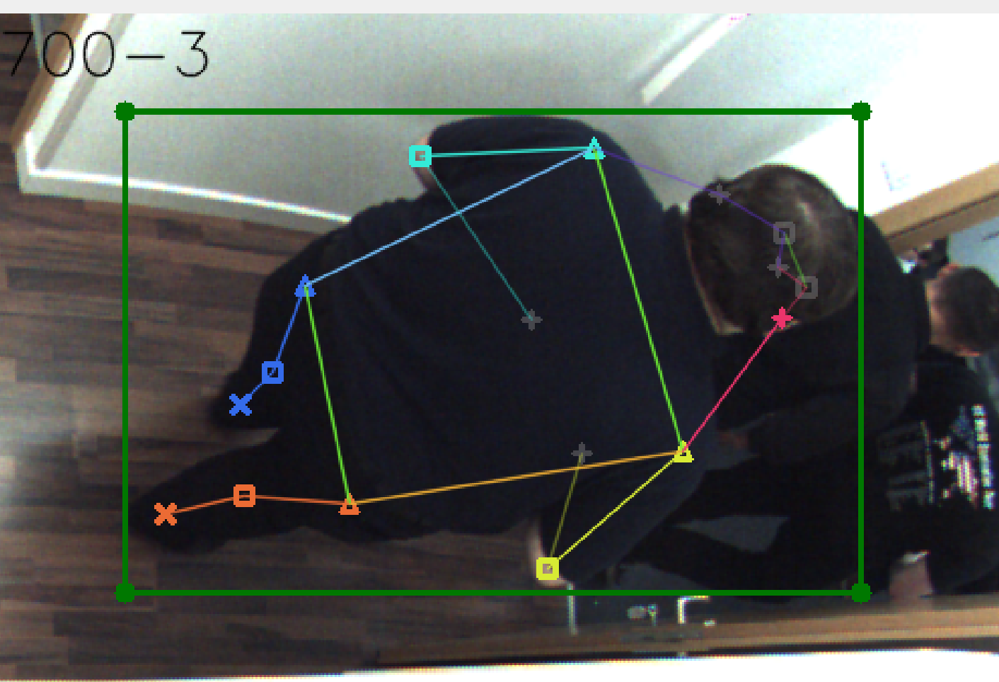
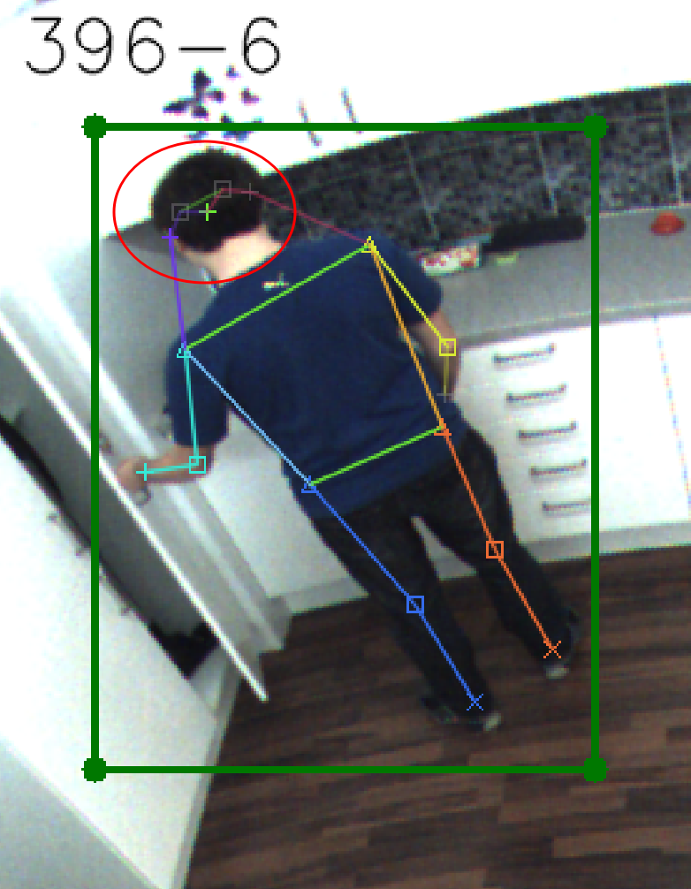
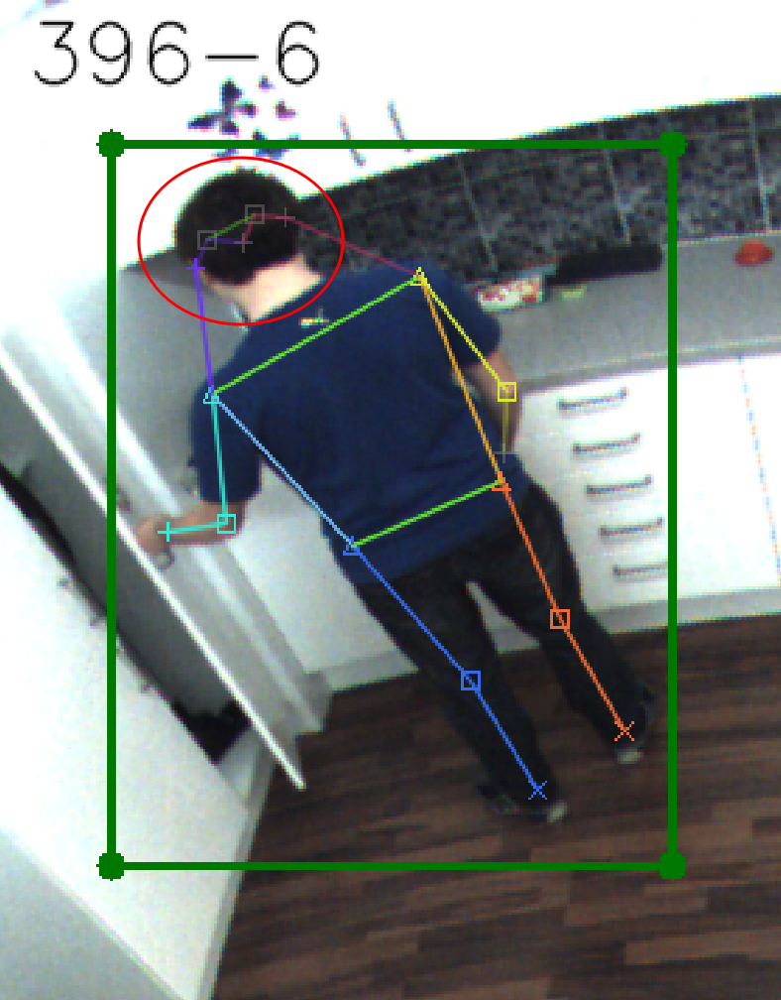
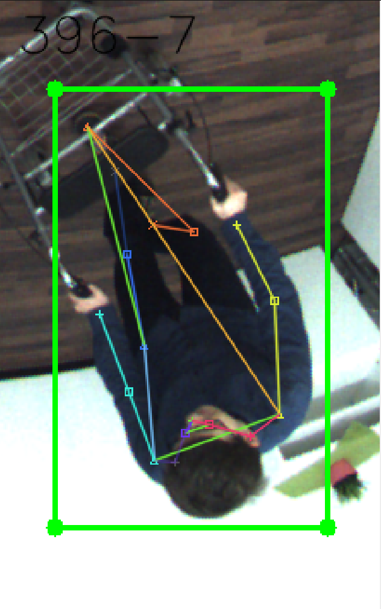
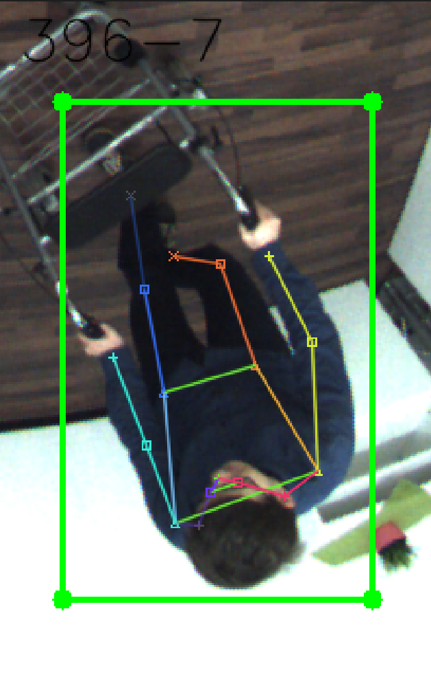
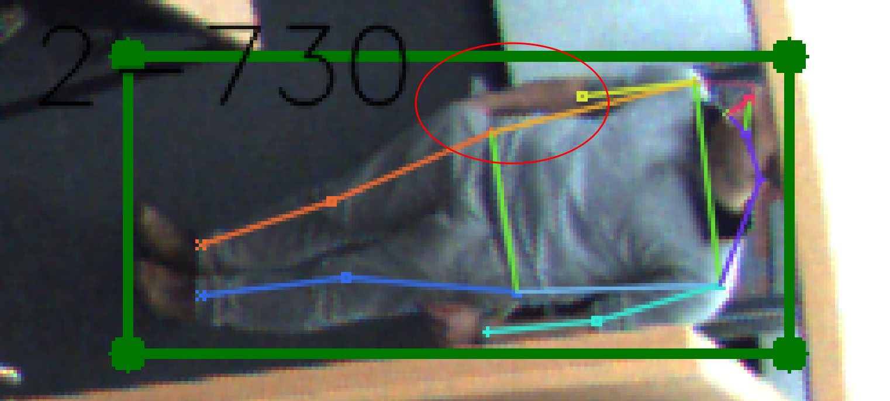
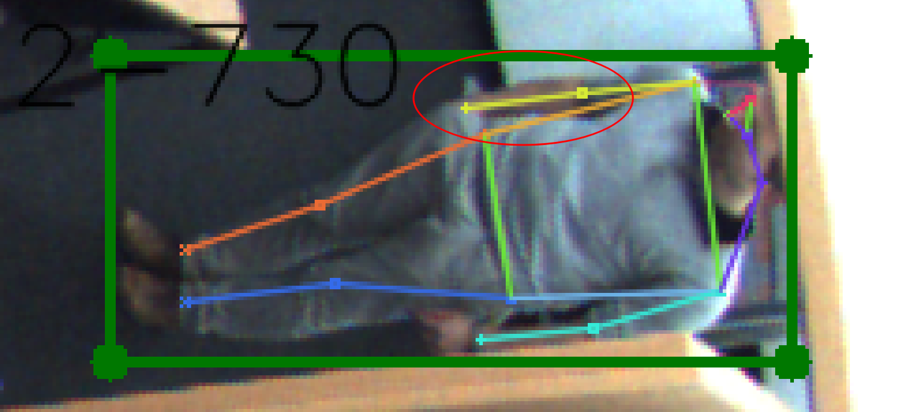

# Example images with annotations

Here are published the example images of correct and wronf annotations.

## Correct example - front

## Correct example - back

## Nose visibility

  
  

## Wrong keypoint

  
  

## Missing limbs

  
  

